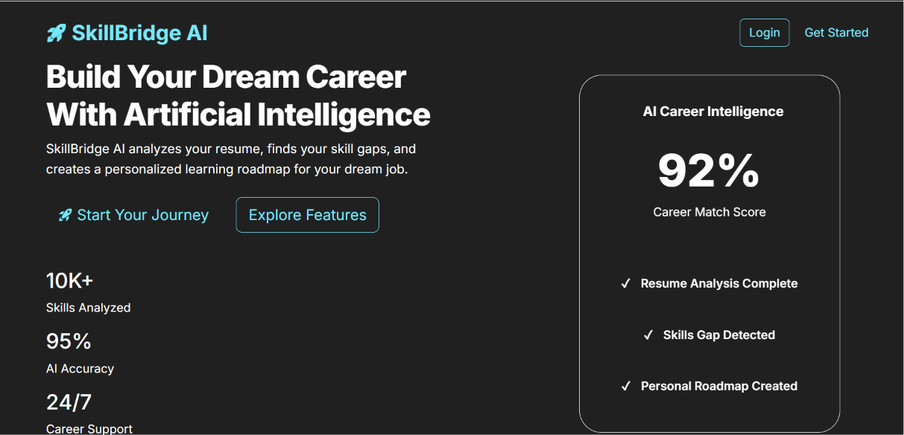
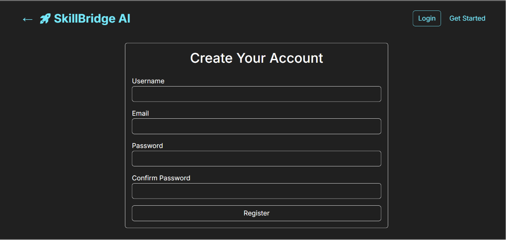
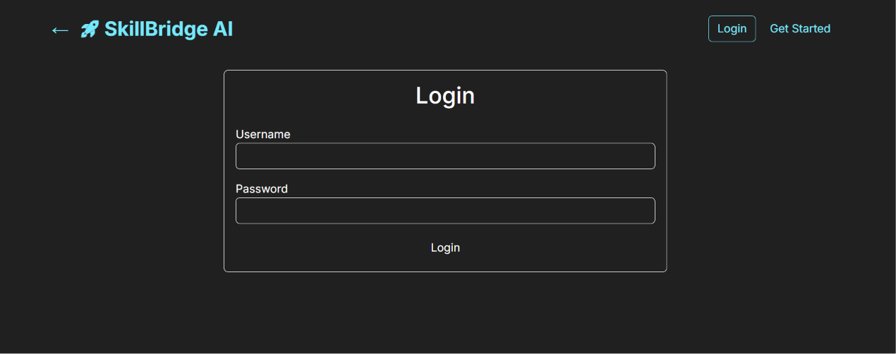
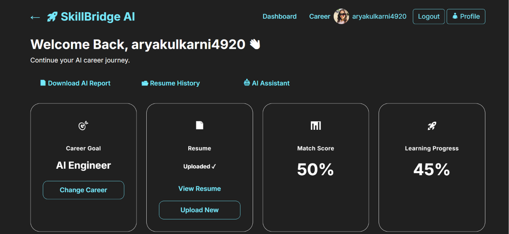
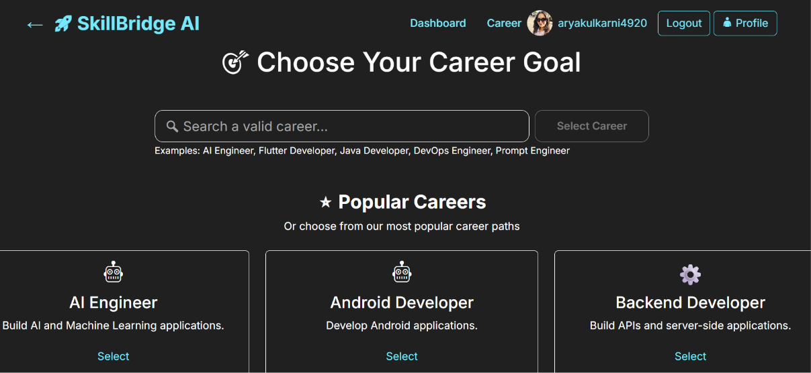
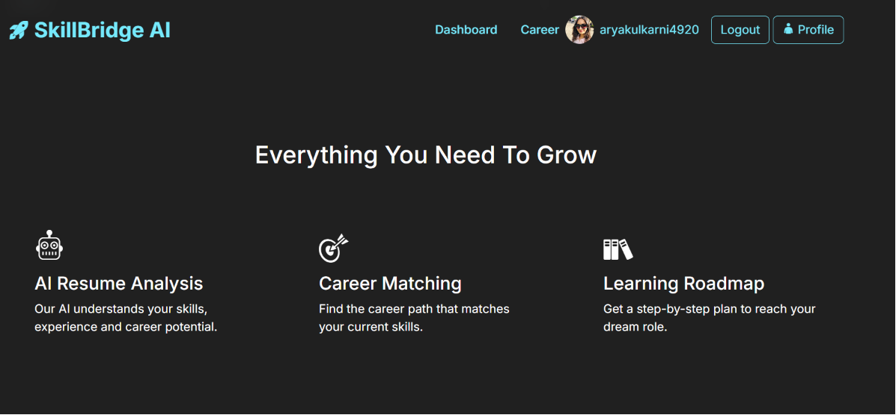
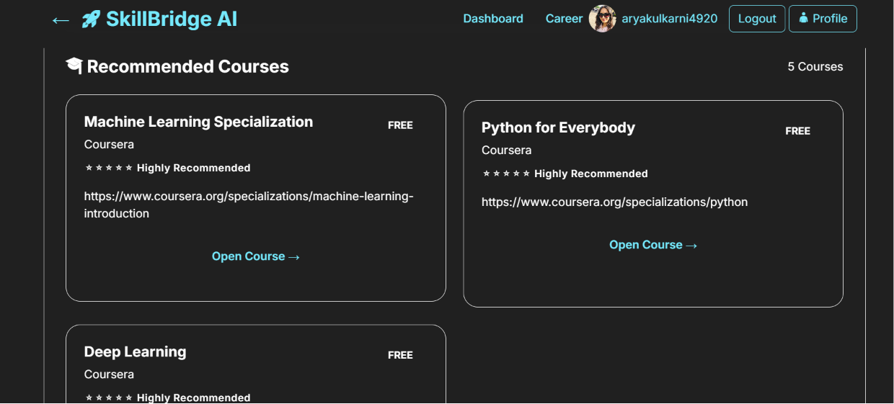
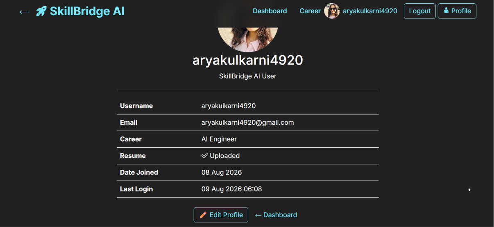

# 🚀 SkillBridge AI

An AI-powered Career Guidance Platform that helps students choose the right career, analyze resumes using AI, identify missing skills, and receive personalized course recommendations.

---

## 🌐 Live Demo

🔗 https://skillbridgeai-production-b9ec.up.railway.app/

---

# 📌 Project Overview

SkillBridge AI helps students bridge the gap between their current skills and their dream careers.

The platform allows users to:

- Register & Login
- Select their Career Goal
- Upload Resume
- Get AI Resume Analysis
- View Missing Skills
- Get Recommended Courses
- Edit Profile
- Upload Profile Picture
- View Job Recommendations

---

# ✨ Features

✅ User Authentication

✅ Career Selection

✅ Resume Upload

✅ AI Resume Analysis (Google Gemini)

✅ Personalized Course Recommendations

✅ Job Recommendations

✅ Cloudinary Profile Image Upload

✅ Responsive UI

---

# 🛠 Tech Stack

## Backend

- Python
- Django

## Database

- PostgreSQL

## AI

- Google Gemini API

## Frontend

- HTML
- CSS
- Bootstrap
- JavaScript

## Media Storage

- Cloudinary

## Deployment

- Railway
- WhiteNoise

---

# 📂 Project Structure

```text
SkillBridgeAI/

├── accounts/
├── ai/
├── config/
├── courses/
├── dashboard/
├── jobs/
├── resumes/
├── static/
├── templates/
├── screenshots/
├── manage.py
├── requirements.txt
└── README.md
```

---

# 📸 Screenshots

## 🏠 Home Page



---

## 🔐 Register



---

## 🔑 Login



---

## 📊 Dashboard



---

## 🎯 Career Selection



---

## 🤖 AI Resume Analysis



---

## 📚 Recommended Courses



---

## 👤 Profile



# 🚀 Installation

Clone the repository

```bash
git clone https://github.com/YOUR_USERNAME/SkillBridgeAI.git
```

Move into project

```bash
cd SkillBridgeAI
```

Create virtual environment

```bash
python -m venv venv
```

Activate environment

Windows

```bash
venv\Scripts\activate
```

Linux / Mac

```bash
source venv/bin/activate
```

Install requirements

```bash
pip install -r requirements.txt
```

Run migrations

```bash
python manage.py migrate
```

Start server

```bash
python manage.py runserver
```

---

# 🔮 Future Improvements

- AI Career Roadmaps
- AI Interview Coach
- Resume Score
- ATS Resume Checker
- AI Chatbot Mentor
- Company Recommendation System
- Progress Tracking Dashboard

---

# 👨‍💻 Developed By

**Arya Kulkarni**

GitHub:
https://github.com/YOUR_USERNAME

---

⭐ If you like this project, don't forget to star the repository!